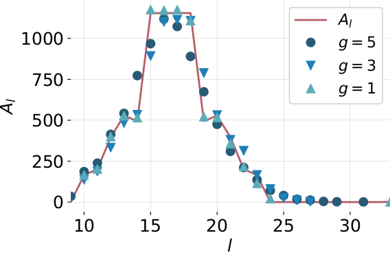
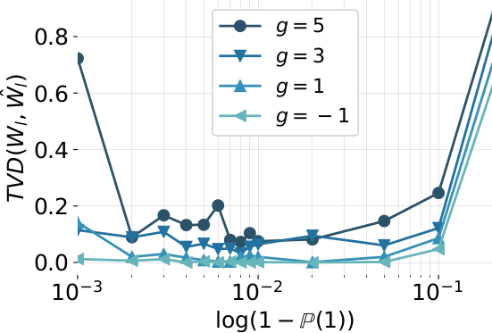

# Linear code weight estimation by random bit stream compression

Source to reproduce the work in our [arxiv paper][arxiv].

## Usage

`python3 BCH_generate.py` will save output from random sampling to `./data`.

`python3 BCH_plot_vs_known.py` compares the estimated and known [weight distribution][weight distribution] directly.

`python3 BCH_plot_TVD.py` measures the [total variation distance][TVD] between the estimates and known distribution.


## Requirements

```bash
sudo apt install sagemath python3-seaborn
```


## Example

The [BCH][BCH](n=33,d=5) code over F(2):





[arxiv]: https://arxiv.org/abs/1806.02099
[weight distribution]: https://en.wikipedia.org/wiki/Weight_enumerator
[TVD]: https://en.wikipedia.org/wiki/Total_variation_distance_of_probability_measures
[BCH]: https://en.wikipedia.org/wiki/BCH_code
